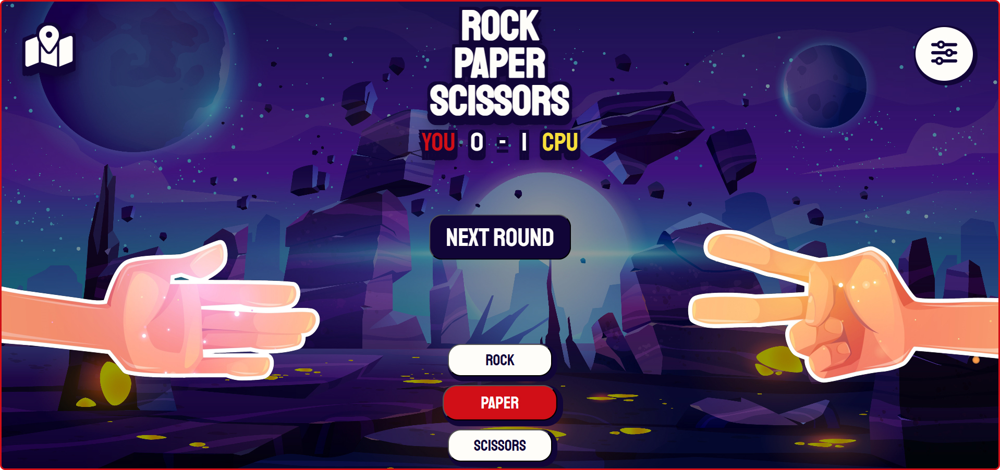
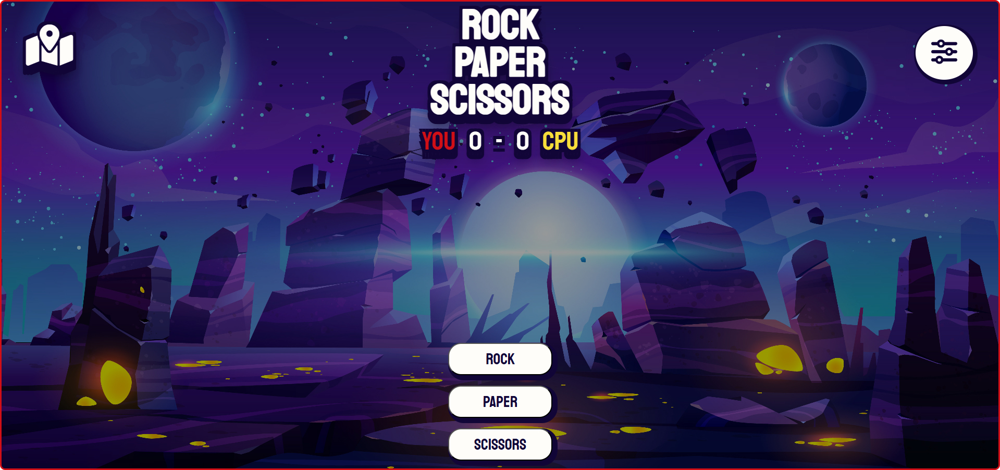
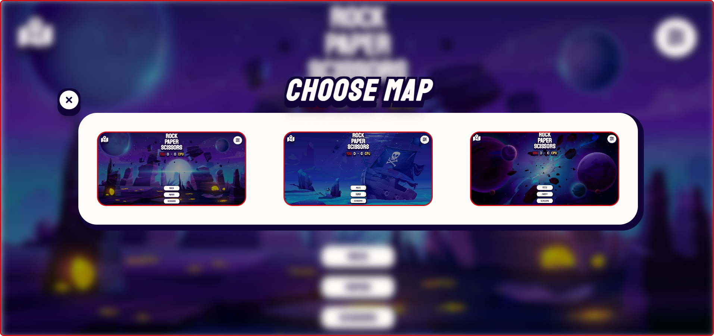
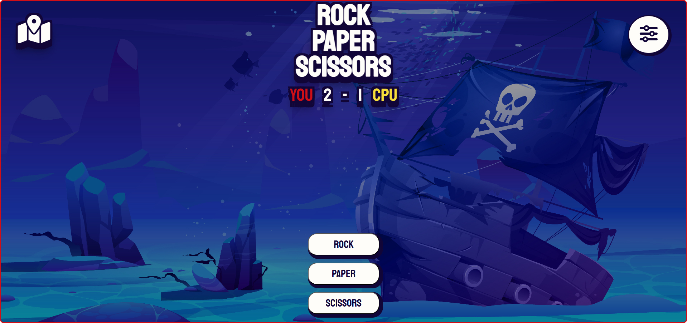

<h1 align="center" style="font-size: 50px">Rock-Paper-Scissors Game</h1>

 

> # [Live Demo](https://jakubkrawiec2001.github.io/Rock-Paper-Scissors-Game/)  

 

## Introduction

This is a simple Rock, Paper, Scissors game built with JavaScript. The game features a fun and engaging user interface where players compete against the CPU. Each round, the player can choose between "Rock," "Paper," or "Scissors" to challenge the CPU’s choice. The game tracks scores and displays them in real time, and players can also switch between different maps for a customized game environment, adding a bit of excitement to this classic game!

## Mockup

 

